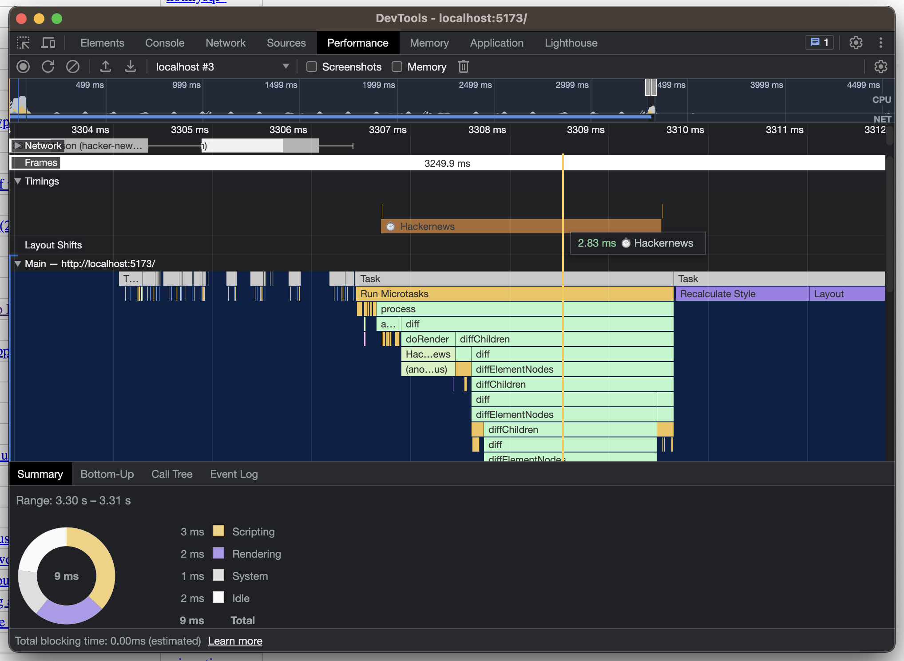

# `preact-perf-profiler`


This library allows you to register a Preact component for measuring its rendering performance using the [User Timing Performance API](https://developer.mozilla.org/en-US/docs/Web/API/Performance_API/User_timing). The measurements show up in the Performance tab timeline in Chromium-based browsers and Firefox browsers and are available through the [`PerformanceObserver` API](https://developer.mozilla.org/en-US/docs/Web/API/Performance_API/Performance_data) if you would like to collect remote telemetry from clients.

## Demo

Check out the repository and run the `dev` script to launch a local demo.

```bash
pnpm install
pnpm run dev
```

Open Dev Tools and you should be able to see the performance measure for the tracked component:



## Usage

The API consist of two methods that take a component class or function and returns it:

- `track(k: ComponentType) => void`
- `untrack(k: ComponentType) => void`

Registering a component adds that component to a `Set` of components. This means that multiple registrations will only add the tracked component once. Same for unregistering.

The easiest way to track a component is to register it where it is defined:

```ts
import { track } from "preact-perf-profiler";

const MyComponent = () => <div>Hello!</div>;

export default MyComponent;

track(MyComponent);
```

If you do not control the source of the component, you can start tracking the component after importing it elsewhere:

```ts
import { track } from "preact-perf-profiler";
import MyComponent from "./my-component.tsx";

track(MyComponent);

const MyOtherComponent = () => <MyComponent />;

export default MyOtherComponent;
```
