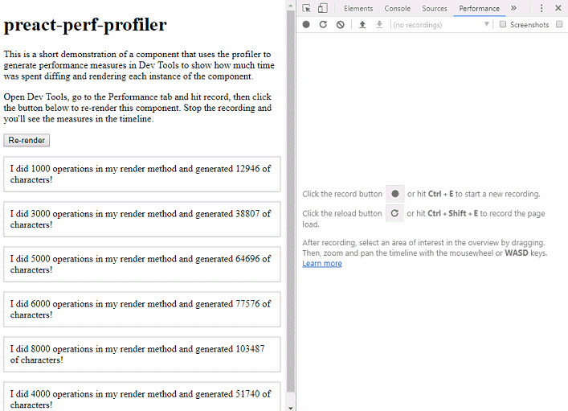

# preact-perf-profiler

[](https://travis-ci.org/KrofDrakula/preact-perf-profiler)

Ever wanted to measure the time spent rendering a component in the
timeline, but soon got tired of manually sprinkling `performance.mark()`
and `performance.measure()` everywhere?

You need this.

## Demo



You can open the example URL as a standalone page to see how this looks
in Dev Tools:

https://3826y5ky55.codesandbox.io/

Here's the full source:

[](https://codesandbox.io/s/3826y5ky55?module=%2Fcomponents%2Fexpensive.js)

## Usage

`withProfiler(AnyComponent [, name [, options]]) => Component`

  - `AnyComponent` can be either a function that returns
     JSX or a class
  - `name` is optional and allows you to configure the measure
    name in the Performance tab
  - `options` is optional and allows you to pass a custom
    implementation for the [Performance API](https://developer.mozilla.org/en-US/docs/Web/API/Performance)

### Configuring the measure name

The optional second argument allows you to pass a string or a
function that the profiler will use to label the measure in the
Performance tab. It will default to the function name if one
is available.

```jsx
// this uses MyComponent.name to generate the measure name
const ProfiledComponent = withProfile(MyComponent);
```

#### As a string

When you pass an anonymous function to the profiler, it's
useful to also define a name for it:

```jsx
const ProfiledComponent = withProfile(
  () => <p>Hello!</p>,
  'HelloComponent'
);
```

#### As a function

You can also pass a function as the second argument, which
will be executed with the props of the component being rendered.
This allows you to label the component in the context of its
props.

```jsx
const ProfiledUser = withProfile(
  User,
  ({ userId }) => `User #${userId}`
);
```

## Walkthrough

Say you have a pure component that you'd like to measure:

```jsx
// expensive_component.js
import { h } from 'preact';

const appendSum = (elements = [1], iterations = 10) => {
  const sum = elements.reduce((sum, next) => sum + next, 0);
  return elements.concat(sum);
};

const ExpensiveComponent = ({ iterations = 500 }) => {
  const sum = appendSum([1, 2], iterations);
  return (
    <div>
      <p>Whew, that was a lot of work, here are the results:</p>
      <ul>
        {sum.map(n => <li>{n}</li>)}
      </ul>
    </div>
  );
};

export default ExpensiveComponent;
```

To render it, just use the `withProfiler` HOC to wrap it:

```jsx
import { h, render } from 'preact';
import withProfiler from 'preact-perf-profiler';
import ExpensiveComponent from './expensive_component';

const ProfiledExpensiveComponent = withProfiler(
  ExpensiveComponent,
  ({ iterations }) => `Expensive(${iterations})`
);

render(<ProfiledExpensiveComponent iterations={1000}/>, document.body);
```

Open the Performance tab and you'll now see each render of
`ProfiledExpensiveComponent` in the measures in Dev Tools.
The measure name will also be displayed as `Expensive(1000)`.
